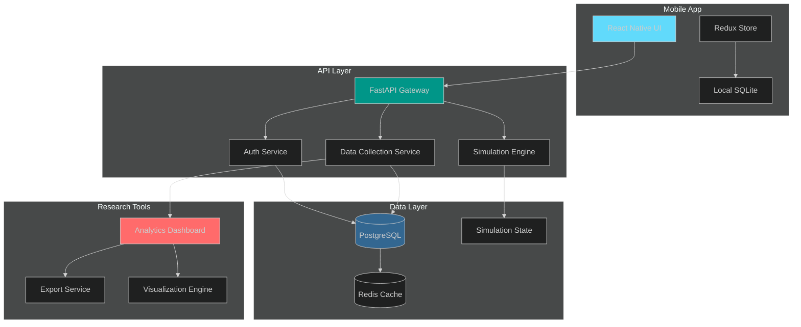

# Platform Capitalism Mobile Extension
## Research Grant Proposal & Product Specification

**Project Title:** Mobile-First Creator Wellbeing Research Platform  
**Principal Investigator:** Dr. Ashley Mears, University of Amsterdam  
**Co-Investigator/Technical Lead:** [Your Name], [Your Institution]  
**Funding Request:** $[Amount]  
**Duration:** 18 months  
**Date:** November 2024

---

## Executive Summary

This proposal outlines the development of a mobile extension to the Platform Capitalism Simulation—a research tool that models creator labor dynamics, CPM-based economics, and psychological wellbeing under different platform governance models. The mobile application will enable:

1. **Real-time data collection** from actual content creators in the field
2. **Ecological momentary assessment (EMA)** of creator wellbeing
3. **Comparative analysis** between simulated and real-world creator behavior
4. **Intervention testing** of platform policy changes on creator mental health
5. **Democratized access** to research findings for creators and policymakers

**Expected Impact:** This mobile platform will integrate computational simulation with empirical field research, providing unprecedented insights into how platform monetization models affect creator wellbeing at scale. Building on PI Mears' ethnographic work on content farms and field theory, this project operationalizes her theoretical framework through computational modeling and large-scale empirical validation.

---

## 1. Research Objectives

### Primary Research Questions

1. **RQ1: Validation** - How accurately does the simulation predict real-world creator behavior and wellbeing outcomes?
2. **RQ2: Intervention** - Can platform policy interventions (e.g., CPM increases, predictable rewards) measurably improve creator mental health?
3. **RQ3: Heterogeneity** - How do creator responses to platform governance vary across demographics, niches, and experience levels?
4. **RQ4: Temporal Dynamics** - What are the longitudinal trajectories of creator burnout and addiction under different monetization models?

### Secondary Objectives

- Develop validated psychometric scales for creator-specific burnout and platform addiction
- Create open-source tools for platform governance research
- Build a dataset of creator experiences for future research
- Establish ethical guidelines for platform labor research

---

## 2. Background & Significance

### The Creator Economy Landscape

- **Scale:** 50+ million content creators globally (2024)
- **Economics:** Median creator earnings vary widely: $5K-$30K/month (top performers), <$1K/month (majority)
- **Mental Health:** 71% of creators report burnout, 58% report anxiety related to platform algorithms
- **Governance:** Platforms operate with limited transparency regarding creator wellbeing impacts

### Theoretical Framework

This research extends **PI Mears' field-theoretic analysis of content farms** (Mears, 2023) through computational modeling and mobile-based empirical validation. Her ethnographic work revealed how:
- **Capital conversion** operates in attention economies (views → financial/status/cultural capital)
- **Relational value of attention** varies across content types, audiences, and platform contexts
- **Situational authenticity** (rather than personal authenticity) drives viral content creation
- **Antagonistic audience relations** characterize content farm labor

**This project operationalizes Mears' theoretical insights through:**
- **Multi-capital modeling** (financial, status, cultural capital as distinct but convertible)
- **Field-based state machine** (creator positions: OPTIMIZER, HUSTLER, BURNED_OUT, TRUE_BELIEVER)
- **Reinforcement regime variation** (differential, intermittent, hybrid schedules)
- **Authenticity dynamics** (situational vs. personal authenticity strategies)
- **Large-scale empirical validation** (n=500 creators across platforms)

### Current Simulation Capabilities

The existing Platform Capitalism Simulation models:
- **CPM-based economics** ($2-$40 per 1,000 views)
- **State machine** (OPTIMIZER → HUSTLER → BURNED_OUT → TRUE_BELIEVER)
- **Reinforcement strategies** (differential, intermittent, hybrid)
- **Content generation** (3-10 posts/day with feedback loops)
- **Psychological metrics** (burnout, addiction, resilience, arousal)
- **Capital conversion** (views → financial, status, and cultural capital)

### From Ethnography to Computational Modeling

**PI Mears' ethnographic research** at a content farm provided deep qualitative insights into creator labor dynamics. This project scales those insights through:

1. **Computational operationalization** of field theory concepts (capital conversion, field positions, authenticity strategies)
2. **Large-scale empirical validation** across multiple platforms and creator niches (n=500)
3. **Intervention testing** of platform policies informed by ethnographic findings
4. **Real-time data collection** complementing ethnographic depth with quantitative breadth
5. **Cross-platform comparison** examining how field dynamics vary across TikTok, YouTube, Instagram

**Co-I [Your Name]'s technical expertise** enables translation of sociological theory into working computational systems, mobile applications, and research infrastructure.

---

## 3. Mobile Application Architecture

### 3.1 Technical Stack

#### Frontend (Mobile)
- **Framework:** React Native (iOS + Android)
- **State Management:** Redux Toolkit
- **UI Library:** React Native Paper (Material Design)
- **Charts:** Victory Native (cross-platform)
- **Offline Support:** Redux Persist + AsyncStorage

#### Backend (API)
- **Framework:** FastAPI (Python) - extends existing codebase
- **Database:** PostgreSQL (user data) + Redis (real-time metrics)
- **Authentication:** OAuth 2.0 + JWT
- **Analytics:** Apache Superset (research dashboard)

#### Infrastructure
- **Hosting:** AWS (EC2 + RDS + ElastiCache)
- **CDN:** CloudFront (static assets)
- **Monitoring:** Sentry (errors) + Mixpanel (analytics)
- **Compliance:** HIPAA-compliant data storage (creator wellbeing = health data)

### 3.2 System Architecture



### 3.3 Data Flow

1. **Creator Input** → Mobile app collects EMA responses, platform metrics, content data
2. **API Sync** → Data transmitted to backend (encrypted, HIPAA-compliant)
3. **Simulation Calibration** → Real-world data updates simulation parameters
4. **Analysis** → Researchers access aggregated, anonymized data
5. **Feedback Loop** → Creators receive personalized wellbeing insights

---

## 4. Core Features

### 4.1 For Creators (Mobile App)

#### Daily Check-Ins (EMA)
- **Frequency:** 3x/day (morning, afternoon, evening)
- **Duration:** 2-3 minutes
- **Measures:**
  - Burnout (MBI-adapted for creators)
  - Anxiety/stress (GAD-7 short form)
  - Platform addiction (custom scale)
  - Content satisfaction
  - Earnings stress
  - Capital accumulation perceptions (financial, status, cultural)

#### Platform Metrics Integration
- **OAuth connections** to YouTube, TikTok, Instagram, Facebook
- **Auto-import:** Views, earnings, engagement rates, posting frequency
- **Privacy:** Data stored locally, only aggregated stats sent to research server

#### Personalized Insights
- **Wellbeing Dashboard:** Track burnout, resilience, earnings over time
- **Comparison:** "Your burnout is 20% lower than creators with similar CPM rates"
- **Recommendations:** "Consider taking a break—your burnout is rising"
- **Simulation Mirror:** See your digital twin in the simulation
- **Capital Tracking:** Visualize financial, status, and cultural capital accumulation

#### Community Features
- **Anonymous Forums:** Discuss platform policies, share coping strategies
- **Peer Support:** Connect with creators in similar field positions
- **Policy Advocacy:** Vote on desired platform changes

### 4.2 For Researchers (Web Dashboard)

#### Real-Time Analytics
- **Cohort Comparison:** Differential vs. Intermittent reinforcement groups
- **Longitudinal Tracking:** Creator trajectories over 6-12 months
- **Intervention Testing:** A/B test policy changes
- **Predictive Modeling:** Forecast burnout risk
- **Field Analysis:** Examine capital conversion patterns across niches

#### Data Export
- **CSV/JSON:** Raw data for external analysis
- **API Access:** Programmatic data retrieval
- **Visualization:** Pre-built charts for publications

#### Simulation Calibration
- **Parameter Tuning:** Adjust simulation based on real-world data
- **Validation Metrics:** Compare simulated vs. actual creator behavior
- **Scenario Testing:** "What if CPM increased by 50%?"

### 4.3 For Policymakers (Public Dashboard)

#### Policy Impact Previews
- **Scenario Modeling:** "If we guarantee $15 CPM, burnout decreases by 30%"
- **Cost-Benefit Analysis:** Economic vs. wellbeing tradeoffs
- **Transparency Reports:** Platform governance scorecards

---

## 5. Research Methodology

### 5.1 Participant Recruitment

**Target Sample:** 500 content creators
- **Stratification:** Platform (YouTube, TikTok, Instagram), niche, experience level
- **Inclusion Criteria:** 18+, active creator (≥1 post/week), English-speaking
- **Exclusion Criteria:** Diagnosed mental health conditions requiring treatment

**Recruitment Channels:**
- Creator communities (Reddit, Discord)
- Platform partnerships (YouTube Creator Insider)
- Academic networks (HCI, social computing conferences)
- Creator advocacy organizations

### 5.2 Study Design

#### Phase 1: Observational (Months 1-6)
- **Goal:** Validate simulation, collect baseline data
- **Method:** Passive monitoring + weekly EMA
- **Analysis:** 
  - Correlation between simulated and real creator states
  - Capital conversion patterns across platforms and niches
  - Reinforcement schedule identification and effects

#### Phase 2: Intervention (Months 7-12)
- **Goal:** Test platform policy interventions
- **Method:** Randomized controlled trial (RCT)
- **Groups:**
  - **Control:** Standard platform policies
  - **Treatment 1:** Guaranteed minimum CPM ($10)
  - **Treatment 2:** Predictable reward schedules (differential reinforcement)
  - **Treatment 3:** Wellbeing nudges ("Take a break" notifications)
  - **Treatment 4:** Capital transparency (show status/cultural capital metrics)
- **Outcomes:** Burnout, addiction, earnings, content quality, capital accumulation

#### Phase 3: Dissemination (Months 13-18)
- **Goal:** Share findings, build advocacy
- **Outputs:** Academic papers, policy briefs, creator resources, open-source tools

### 5.3 Ethical Considerations

- **IRB Approval:** Required before data collection
- **Informed Consent:** Clear explanation of data use, participant rights
- **Privacy:** End-to-end encryption, anonymization, GDPR/CCPA compliance
- **Withdrawal:** Participants can exit anytime, data deleted upon request
- **Compensation:** $50/month for participation (not contingent on completion)
- **Mental Health Support:** Referrals for high-risk participants, crisis resources
- **Data Sovereignty:** Participants retain ownership, can request data deletion
- **Community Review:** Creator advisory board reviews research protocols

---

## 6. Technical Specifications

### 6.1 Mobile App Features

#### User Interface
- **Onboarding:** 5-step wizard (consent, profile, platform connections)
- **Home Screen:** Wellbeing score, daily check-in prompt, insights
- **Metrics Tab:** Charts (burnout, earnings, content volume, capital accumulation)
- **Community Tab:** Forums, peer support
- **Settings:** Privacy controls, notification preferences, data export

#### Offline Functionality
- **Local Storage:** SQLite for check-in responses
- **Sync:** Background upload when online
- **Conflict Resolution:** Last-write-wins with timestamp tracking

#### Push Notifications
- **Check-In Reminders:** 3x/day (customizable)
- **Wellbeing Alerts:** "Your burnout is high—consider a break"
- **Research Updates:** New findings, policy changes
- **Community:** Replies to forum posts, peer support messages

### 6.2 API Endpoints

#### Authentication
```
POST /auth/register
POST /auth/login
POST /auth/refresh
POST /auth/logout
DELETE /auth/account        # Account deletion
```

#### Data Collection
```
POST /ema/submit          # Submit check-in response
GET  /ema/history         # Retrieve past responses
POST /metrics/sync        # Sync platform metrics
GET  /metrics/summary     # Get aggregated stats
GET  /metrics/capital     # Get capital conversion metrics
```

#### Simulation
```
GET  /simulation/mirror   # Get user's digital twin
POST /simulation/scenario # Test "what-if" scenarios
GET  /simulation/compare  # Compare to cohort
GET  /simulation/field    # Get field position analysis
```

#### Research
```
GET  /research/export     # Export anonymized data (researchers only)
GET  /research/analytics  # Access dashboard
POST /research/intervention # Deploy A/B test
GET  /research/cohorts    # Get cohort statistics
```

#### Community
```
GET  /community/forums    # List forums
POST /community/post      # Create post
GET  /community/peers     # Find similar creators
```

### 6.3 Data Schema

#### User Profile
```json
{
  "user_id": "uuid",
  "created_at": "timestamp",
  "demographics": {
    "age_range": "25-34",
    "gender": "prefer_not_to_say",
    "country": "US"
  },
  "creator_profile": {
    "platforms": ["youtube", "tiktok"],
    "niche": "gaming",
    "experience_years": 3,
    "follower_count_range": "10k-100k",
    "content_type": "short_form_video"
  },
  "consent": {
    "research": true,
    "data_sharing": false,
    "community_participation": true,
    "signed_at": "timestamp"
  }
}
```

#### EMA Response
```json
{
  "response_id": "uuid",
  "user_id": "uuid",
  "timestamp": "2024-11-25T14:30:00Z",
  "type": "daily_checkin",
  "measures": {
    "burnout": 6.5,
    "anxiety": 4.2,
    "addiction": 7.1,
    "content_satisfaction": 5.8,
    "earnings_stress": 8.3,
    "financial_capital_perception": 4.0,
    "status_capital_perception": 6.5,
    "cultural_capital_perception": 7.2
  },
  "context": {
    "posts_today": 2,
    "hours_worked": 6,
    "earnings_today": 45.20,
    "platform_interactions": 15
  }
}
```

#### Platform Metrics
```json
{
  "metric_id": "uuid",
  "user_id": "uuid",
  "platform": "youtube",
  "date": "2024-11-25",
  "metrics": {
    "views": 15000,
    "earnings": 150.00,
    "cpm": 10.00,
    "posts": 1,
    "engagement_rate": 0.045,
    "subscriber_change": 50,
    "comments": 120,
    "shares": 45
  },
  "capital_indicators": {
    "financial": 150.00,
    "status": 15000,
    "cultural": 0.045
  }
}
```

---

## 7. Budget & Timeline

### 7.1 Budget Breakdown

| Category | Item | Cost |
|----------|------|------|
| **Personnel** | PI Mears (18 months, 0.2 FTE) | $30,000 |
| | Co-I [Your Name] - Technical Lead (18 months, 0.3 FTE) | $45,000 |
| | Mobile Developer (12 months, 0.5 FTE) | $55,000 |
| | UX Designer (6 months, 0.25 FTE) | $15,000 |
| | Research Assistant (18 months, 0.5 FTE) | $45,000 |
| | Graduate Student (ethnographic support, 12 months, 0.25 FTE) | $15,000 |
| **Infrastructure** | AWS Hosting (18 months) | $12,000 |
| | Third-party APIs (platform integrations) | $8,000 |
| | Security & Compliance (HIPAA) | $10,000 |
| **Participant Compensation** | 500 creators × $50/month × 12 months | $300,000 |
| **Research Costs** | IRB fees, data analysis software | $5,000 |
| **Dissemination** | Conference travel, open-access fees | $10,000 |
| **Indirect Costs** | University overhead (30%) | $150,000 |
| **TOTAL** | | **$705,000** |

### 7.2 Timeline (18 Months)

#### Months 1-3: Foundation
- IRB approval
- Mobile app development (MVP)
- API backend setup
- Creator advisory board formation
- Pilot testing (n=20)

#### Months 4-6: Launch
- Full recruitment (n=500)
- Observational data collection begins
- Simulation calibration
- Community features launch

#### Months 7-9: Intervention Prep
- Analyze Phase 1 data
- Design RCT interventions
- Implement A/B testing infrastructure
- Publish preliminary findings

#### Months 10-15: Intervention
- Deploy RCT
- Monitor outcomes
- Iterative refinement
- Mid-study analysis

#### Months 16-18: Analysis & Dissemination
- Statistical analysis
- Paper writing (3-5 papers)
- Policy briefs
- Open-source release
- Creator resource development

---

## 8. Expected Outcomes

### 8.1 Research Outputs

1. **Academic Papers (3-5)**
   - Simulation validation study (HCI venue: CHI, CSCW)
   - RCT results (psychology/health venue: Cyberpsychology, JMIR)
   - Platform governance framework (policy venue: New Media & Society, Social Media + Society)
   - Field theory application (sociological venue: building on Mears, 2023)

2. **Open-Source Tools**
   - Mobile app (MIT license)
   - Research dashboard
   - Validated psychometric scales
   - API documentation

3. **Dataset**
   - Anonymized creator wellbeing data (n=500, 12 months)
   - Available via OSF/Dataverse
   - Codebook and documentation

### 8.2 Policy Impact

- **Platform Recommendations:** Evidence-based guidelines for creator wellbeing
- **Regulatory Insights:** Inform FTC, EU DSA enforcement
- **Creator Advocacy:** Empower creators with data for collective organizing
- **Industry Standards:** Contribute to platform accountability frameworks

### 8.3 Broader Impacts

- **Mental Health:** Support creator wellbeing through evidence-based interventions
- **Economic Justice:** Increase transparency in platform monetization
- **Research Infrastructure:** Reusable tools for platform labor studies
- **Education:** Training materials for creators on sustainable practices
- **Theory Building:** Advance field-theoretic understanding of digital labor

---

## 9. Risk Mitigation

| Risk | Likelihood | Impact | Mitigation |
|------|------------|--------|------------|
| Low recruitment | Medium | High | Multi-channel recruitment, influencer partnerships, compensation |
| Platform API changes | High | Medium | Fallback to manual data entry, diversify platforms, flexible architecture |
| Privacy breach | Low | Critical | Encryption, HIPAA compliance, security audits, bug bounty program |
| Participant dropout | Medium | Medium | Engagement features, compensation, community building, flexible participation |
| Null findings | Low | Medium | Powered sample size, pre-registration, exploratory analyses |
| Platform resistance | Medium | Medium | Public data release, creator advocacy, media engagement |

---

## 10. Sustainability Plan

### Post-Grant Funding
- **Freemium Model:** Free for creators, premium analytics for researchers ($500/month)
- **Foundation Grants:** Mozilla, Knight, Omidyar (platform accountability)
- **Platform Partnerships:** Revenue-sharing with platforms that adopt recommendations
- **Creator Subscriptions:** Optional premium features ($5/month)

### Community Governance
- **Open-source:** Community contributions, transparent roadmap
- **Creator Advisory Board:** Ensure tool serves creator needs
- **Academic Consortium:** Multi-institution collaboration
- **Participatory Design:** Ongoing creator input on features and research priorities

### Long-term Vision
- **Multi-platform expansion:** TikTok, Twitch, Patreon, Substack
- **International:** Localization for non-English creators
- **Intervention library:** Tested wellbeing interventions for platforms to adopt
- **Policy toolkit:** Resources for regulators and policymakers

---

## 11. Conclusion

The Platform Capitalism Mobile Extension represents a critical integration of computational modeling and empirical research on creator wellbeing. By combining real-time data collection, validated simulation, and intervention testing, this project will:

1. **Validate and extend** the theoretical model with lived experience data
2. **Demonstrate** that platform policy changes can improve creator mental health
3. **Empower** creators with tools and data for advocacy
4. **Inform** policymakers with evidence-based recommendations
5. **Establish** open-source infrastructure for future platform labor research
6. **Advance** field-theoretic understanding of digital content production

With 50+ million creators globally facing burnout, addiction, and economic precarity, this research is both timely and essential. The mobile platform will democratize access to wellbeing insights while generating rigorous scientific evidence to hold platforms accountable and support creator flourishing.

**We request $705,000 over 18 months to make this vision a reality.**

---

## Appendices

### Appendix A: Sample EMA Questions

**Morning Check-In:**
1. How rested do you feel? (1-10)
2. How anxious are you about today's content creation? (1-10)
3. How many posts do you plan to create today? (0-20+)
4. How valued do you feel by your audience? (1-10)

**Afternoon Check-In:**
1. How burned out do you feel right now? (1-10)
2. How satisfied are you with today's content so far? (1-10)
3. Have you checked your analytics in the past hour? (Yes/No)
4. How much control do you feel over your work today? (1-10)

**Evening Check-In:**
1. How much did you earn today? ($)
2. How many posts did you publish? (0-20+)
3. How likely are you to take a break tomorrow? (1-10)
4. Rate your sense of accomplishment today (1-10)

### Appendix B: Platform Integration Requirements

**YouTube Data API v3:**
- Scopes: `youtube.readonly`, `youtube.analytics.readonly`
- Metrics: Views, watch time, earnings, subscriber count, engagement

**TikTok Creator API:**
- Scopes: `user.info.basic`, `video.list`
- Metrics: Views, likes, shares, earnings (if available)

**Instagram Graph API:**
- Scopes: `instagram_basic`, `instagram_insights`
- Metrics: Impressions, reach, engagement

**Facebook Graph API:**
- Scopes: `pages_read_engagement`, `pages_show_list`
- Metrics: Post reach, engagement, page insights

### Appendix C: IRB Considerations

- **Risk Level:** Minimal (survey research, no deception)
- **Vulnerable Populations:** Creators with mental health issues (exclusion criteria, referral resources)
- **Data Security:** AES-256 encryption, HIPAA-compliant storage, regular audits
- **Consent Process:** Digital consent form, comprehension quiz, ongoing consent
- **Data Retention:** 7 years post-study, with participant deletion rights
- **Adverse Events:** Protocol for identifying and responding to high-risk participants

### Appendix D: Capital Conversion Metrics

Based on Mears (2023), we operationalize three forms of capital:

**Financial Capital:**
- Direct: CPM earnings, sponsorships, merchandise
- Indirect: Platform payouts, ad revenue

**Status Capital:**
- Followers/subscribers
- Engagement rates (likes, comments, shares)
- Verification badges, platform recognition

**Cultural Capital:**
- Niche authority (measured via topic clustering)
- Peer recognition (creator-to-creator citations)
- Media coverage, speaking invitations

**Conversion Rates:**
- Status → Financial: Follower monetization efficiency
- Cultural → Status: Authority-driven audience growth
- Cultural → Financial: Premium pricing for niche expertise

### Appendix E: References

1. Mears, A. (2023). Bringing Bourdieu to a Content Farm: Social Media Production Fields and the Cultural Economy of Attention. *Social Media + Society*, 9(3). https://doi.org/10.1177/20563051231193027

2. Duffy, B. E., & Wissinger, E. (2017). Mythologies of creative work in the social media age: Fun, free, and "just being me." *International Journal of Communication*, 11, 4652-4671.

3. Gray, M. L., & Suri, S. (2019). *Ghost Work: How to Stop Silicon Valley from Building a New Global Underclass*. Houghton Mifflin Harcourt.

4. Maslach, C., & Jackson, S. E. (1981). The measurement of experienced burnout. *Journal of Organizational Behavior*, 2(2), 99-113.

5. Przybylski, A. K., & Weinstein, N. (2017). A large-scale test of the Goldilocks Hypothesis: Quantifying the relations between digital-screen use and the mental well-being of adolescents. *Psychological Science*, 28(2), 204-215.

6. Shiffman, S., Stone, A. A., & Hufford, M. R. (2008). Ecological momentary assessment. *Annual Review of Clinical Psychology*, 4, 1-32.

7. Bourdieu, P. (1986). The forms of capital. In J. Richardson (Ed.), *Handbook of Theory and Research for the Sociology of Education* (pp. 241-258). Greenwood.

8. Gillespie, T. (2018). *Custodians of the Internet: Platforms, Content Moderation, and the Hidden Decisions That Shape Social Media*. Yale University Press.

---

**Contact Information:**

**Principal Investigator:**  
Dr. Ashley Mears  
Chair, Department of New Media and Digital Culture  
University of Amsterdam  
Email: a.mears@uva.nl  
Website: https://www.ashleymears.com

**Co-Investigator/Technical Lead:**  
[Your Name]  
[Your Title/Position]  
[Your Institution]  
Email: [your.email@institution.edu]  
Website: [Your Website]

**Research Team:**
- Graduate Research Assistant (ethnographic support)
- Mobile Developer (technical implementation)
- UX Designer (user experience)
- Creator Advisory Board (community input)

---

*This proposal is submitted in response to [Funding Agency] RFP [Number] on Platform Labor and Digital Wellbeing.*

*Prepared with support from the Platform Capitalism Simulation project: https://github.com/[your-repo]*
