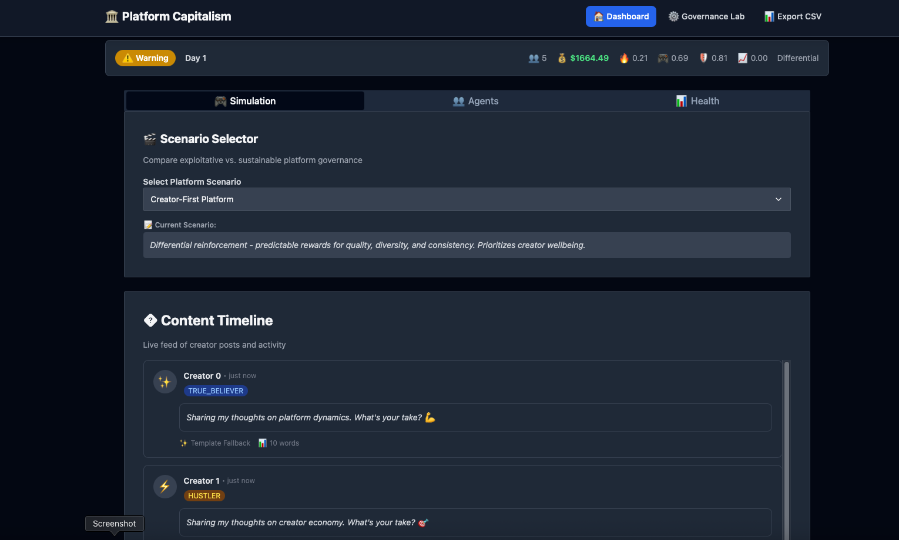
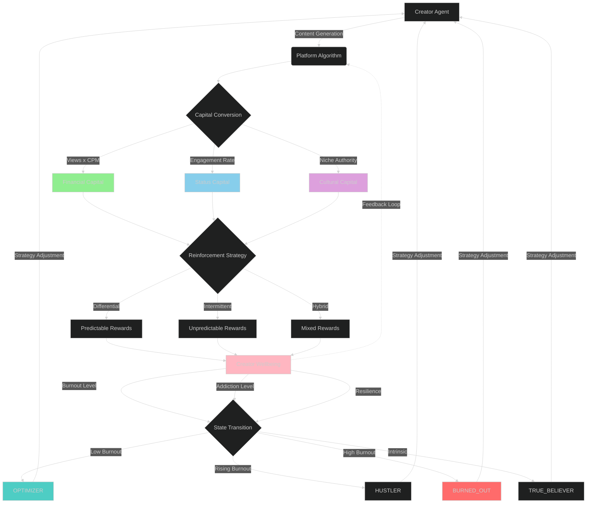
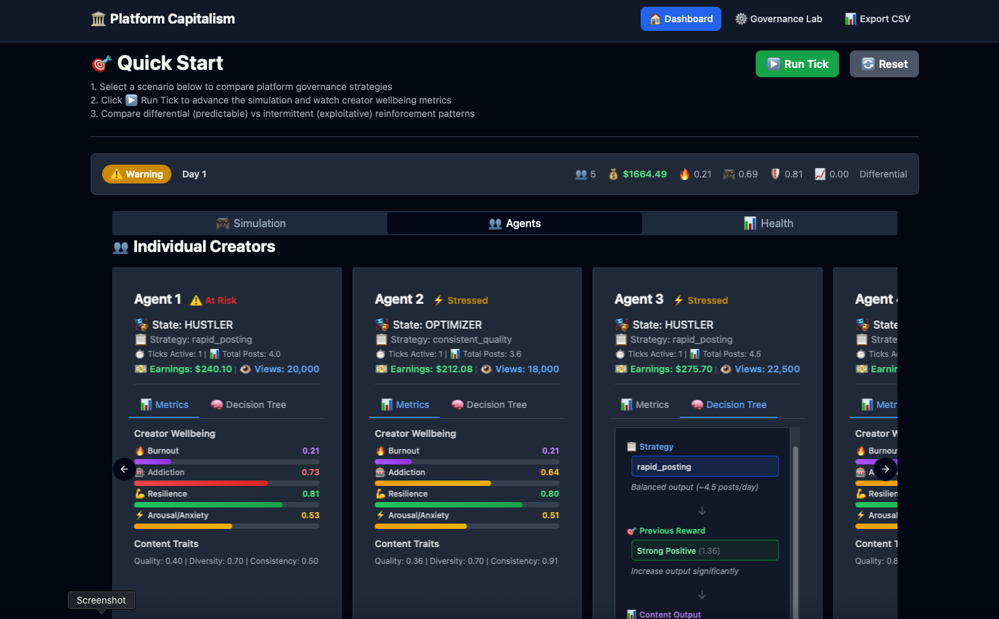
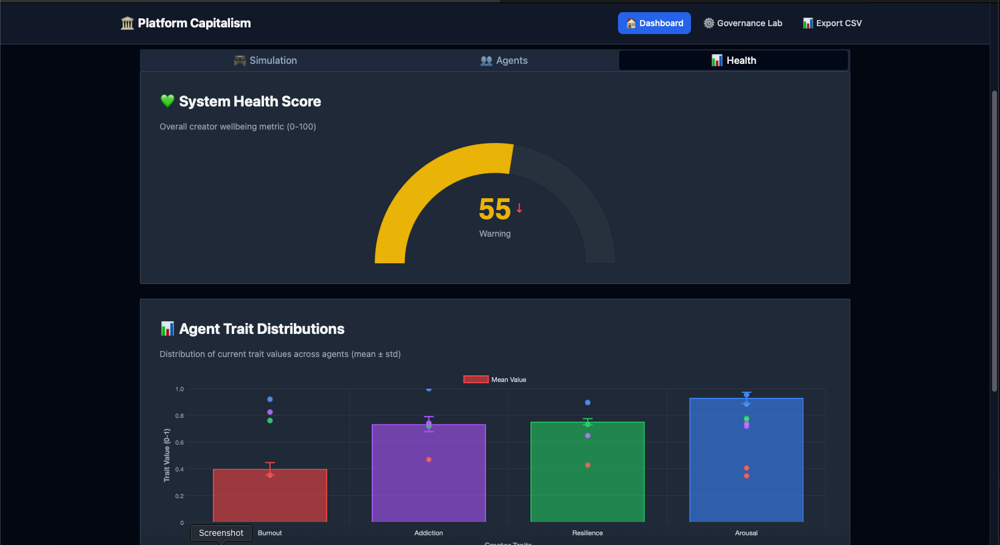
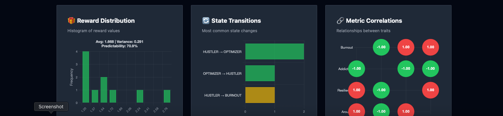
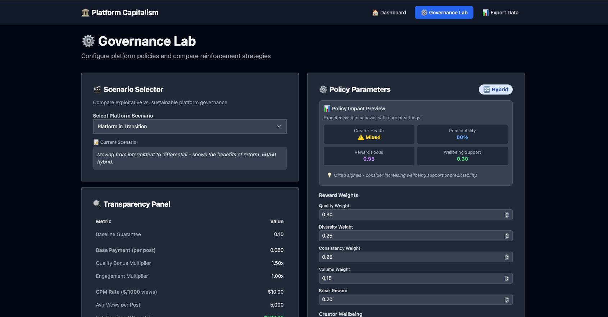
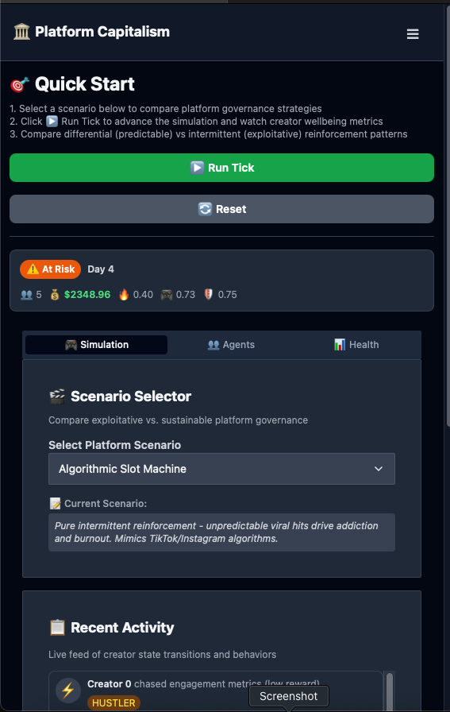
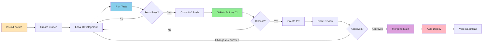

# Platform Capitalism Simulation

<!-- Update YOUR_USERNAME with your GitHub username after first push -->
[](https://github.com/codeamt/platform-capitalism/actions/workflows/ci.yml)
[](https://codeamt.github.io/platform-capitalism)
[](https://www.python.org/downloads/)
[](LICENSE)

> **A research-driven simulation exploring creator wellbeing under different platform governance models**

This simulation environment models creator labor within platform economies using a state-machine framework where agents transition between four archetypal creative states—Optimizer, Hustler, True Believer, and Burnout—based on differential and intermittent reinforcement schedules. Agents generate content dynamically (3-10 posts/day) with earnings calculated via realistic CPM-based economics ($2-$40 per 1,000 views), reflecting empirical data from content farm research. A policy engine implements variable reinforcement regimes that shape creator behavior through rewards for quality, consistency, diversity, and volume, while tracking both monetary earnings and psychological metrics (view counts, addiction, burnout, resilience). The research dashboard provides real-time visibility into algorithmic decision-making and creator wellbeing through interactive visualizations, decision tree transparency tools, scenario comparison, and policy impact previews. This system enables researchers to experimentally investigate how platform monetization models and reinforcement schedules interact to shape creator mental health, economic outcomes, and behavioral patterns, offering an accessible framework for studying the economic and psychological dynamics of platform labor.


*Interactive dashboard showing creator states, system health, and real-time metrics*

---

## 📊 Research Foundation

Based on empirical research into creator economies, particularly:

**Primary Research:**

1. **Mears, A. (2025).** [*Learning to Like the Likes and the Hate: The Labor of Internet Fame in the New Attention Economy*](https://academic.oup.com/socpro/advance-article/doi/10.1093/socpro/spaf028/8165972). Social Problems.

2. **Mears, A. (2023).** [*Bringing Bourdieu to a Content Farm: Social Media Production Fields and the Cultural Economy of Attention*](https://journals.sagepub.com/doi/abs/10.1177/20563051231193027). Social Media + Society, 9(3).

**Key Insights:**
- CPM-based monetization ($2-$40 per 1,000 views)
- Content farm economics (median $5K-$30K/month per page)
- Platform reinforcement strategies (differential vs. intermittent)
- Creator burnout and addiction patterns
- Capital conversion dynamics (financial, status, cultural)

### Platform Dynamics



**Key Dynamics:**
- Capital Conversion: Content → Views → CPM Earnings + Status + Cultural Authority
- Reinforcement: Platform strategy (differential/intermittent/hybrid) shapes reward patterns
- Wellbeing Impact: Rewards affect burnout, addiction, and resilience
- State Transitions: Wellbeing determines creator state (OPTIMIZER → HUSTLER → BURNED_OUT)
- Feedback Loop: Creator state influences future content generation strategy

### Additional Screenshots

#### Agent Decision Tree

*Individual creator cards with decision tree visualization and wellbeing metrics*

#### System Health Analytics - Part 1

*System health gauge and agent trait distributions*

#### System Health Analytics - Part 2

*Reward characteristics, state transitions, and metric correlations*

#### Governance Lab

*Policy configuration interface for experimenting with platform governance models*

#### Mobile Responsive Design
<p align="center">
  
</p>

*Fully responsive interface optimized for mobile devices*

---

## 🚀 Quick Start

### Local Development

```bash
# Clone the repository
git clone https://github.com/codeamt/platform-capitalism.git
cd platform-capitalism

# Install dependencies
make install

# (Optional) Copy environment variables
cp .env.example .env

# Run development server
make dev
```

Open `http://localhost:5001` in your browser.

### Using the Simulation

1. Select a scenario from the dropdown:
   - Algorithmic Slot Machine (Exploitative)
   - Engagement Maximizer (Balanced)
   - Creator-First Platform (Optimal)
   - Cooperative Commons (Cooperative)

2. Click "Run Tick" to advance the simulation by one day

3. Observe real-time metrics:
   - Platform Earnings (CPM-based)
   - Total Views across all creators
   - Individual agent states and strategies
   - Creator Burnout levels
   - Addiction Drive
   - Resilience scores

4. Explore transparency tools:
   - Decision trees showing agent reasoning
   - Policy configuration details
   - Historical trend charts

### Deployment Options

#### Quick Demo (Vercel)
```bash
# Deploy to Vercel for demo/sharing
make quick-vercel

# Or with production flag
vercel --prod
```

#### Research Deployment (AWS Lightsail)
```bash
# One-command deployment
make quick-research

# Or step-by-step
make terraform-init
make terraform-plan
make terraform-apply
make terraform-output  # Get deployment URL
```

**Cost:** ~$20/month for research deployments

#### Docker (Local Testing)
```bash
# Build and run locally
make quick-demo

# Or manually
make docker-build
make docker-run
```

See [`deploy/DEPLOYMENT_GUIDE.md`](deploy/DEPLOYMENT_GUIDE.md) for detailed deployment instructions.

### Available Commands

Run `make` or `make help` to see all available commands:

```bash
# Development
make dev                # Run development server
make test               # Run pytest test suite
make test-coverage      # Run tests with coverage

# Docker
make docker-build       # Build Docker image
make docker-run         # Run Docker container
make docker-push        # Push to GitHub Container Registry

# Deployment
make deploy-vercel      # Deploy to Vercel (preview)
make deploy-vercel-prod # Deploy to Vercel (production)
make terraform-apply    # Deploy to AWS Lightsail
make lightsail-logs     # View deployment logs

# Documentation
make docs-serve         # Serve MkDocs locally
make docs-deploy        # Deploy docs to GitHub Pages

# Utilities
make format             # Format code with ruff
make lint               # Lint code
make clean              # Clean temporary files
```

---

## 🎮 Simulation Dynamics

### CPM-Based Economics

**Formula:**
```
Earnings = (Posts × Views_per_Post / 1000) × CPM_Rate × Quality_Bonus × Engagement_Bonus
```

**Example (Optimal Scenario):**
- Agent posts **5 posts/day**
- Each post gets **5,000 views**
- CPM = **$10**
- Quality bonus = **1.4x**
- Engagement bonus = **1.0x**

**Daily Earnings:** `(5 × 5,000 / 1,000) × $10 × 1.4 × 1.0 = $350/day`

**Monthly:** ~$10,500 (matches research: median $5K-$30K/mo)

### Scenario Comparison

| Scenario | CPM | Views/Post | Est. Daily Earnings* |
|----------|-----|------------|---------------------|
| **Exploitative** | $5 | 3,000 | $75-$150 |
| **Optimal** | $10 | 5,000 | $250-$500 |
| **Balanced** | $15 | 7,000 | $525-$1,050 |
| **Cooperative** | $20 | 10,000 | $1,000-$2,000 |

*Based on 5 posts/day, quality 0.8

### Agent Behavior Model

**Content Generation**

Agents generate content based on:
1. Strategy (rapid_posting, strategic_pause, consistent_quality)
2. Previous Reward (positive/negative reinforcement)
3. Quality Trait (base productivity)

**Formula:**
```python
posts_per_day = quality × (base_frequency + feedback_modifier) × 10.0
```

**State Machine**

Agents transition between states based on burnout and rewards:
- OPTIMIZER: Balanced, sustainable
- HUSTLER: High output, rising burnout
- TRUE_BELIEVER: Intrinsically motivated
- BURNED_OUT: Exhausted, low output

**Psychological Metrics**

- Burnout: Accumulates with high output, decreases with rest
- Addiction: Driven by intermittent reinforcement
- Resilience: Ability to recover from negative rewards
- Arousal/Anxiety: Engagement with platform

### Platform Governance Models

**1. Exploitative Platform**
- CPM: $5 (low)
- Reinforcement: Intermittent (unpredictable)
- Views: 3,000/post (harder to grow)
- Result: High burnout, low earnings, addiction

**2. Optimal Platform**
- CPM: $10 (fair)
- Reinforcement: Differential (predictable)
- Views: 5,000/post (moderate growth)
- Result: Sustainable, balanced earnings

**3. Balanced Platform**
- CPM: $15 (good)
- Reinforcement: Hybrid (50/50 mix)
- Views: 7,000/post (growing audience)
- Result: Moderate burnout, good earnings

**4. Cooperative Platform**
- CPM: $20 (premium)
- Reinforcement: Differential + UBI
- Views: 10,000/post (large audience)
- Result: Low burnout, high earnings, sustainable

### Metrics & Analytics

**Agent-Level Metrics**
- Earnings: Total CPM-based revenue
- Views: Total content views
- Posts: Total content generated
- Burnout: Exhaustion level (0-1)
- Addiction: Compulsive behavior (0-1)
- Resilience: Recovery ability (0-1)
- Quality/Diversity/Consistency: Content traits (0-1)

**Platform-Level Metrics**
- Total Earnings: Aggregate creator revenue
- Average Burnout: Platform health indicator
- Burnout Rate: % of creators in BURNED_OUT state
- Addiction Rate: % of creators with high addiction
- Mode: Reinforcement strategy (differential/intermittent/hybrid)

---

## 📁 Project Structure

```
platform-capitalism/
├── main.py                 # FastHTML application entry point
├── simulation/
│   ├── agents/            # Agent behavior, state machine, strategies
│   ├── policy_engine/     # Reward calculation, CPM economics
│   ├── scenarios/         # Platform governance presets
│   └── environment.py     # Simulation orchestration
├── ui/
│   ├── components/        # Agent cards, decision trees, charts
│   └── pages/            # Dashboard, governance lab
├── routes/               # API endpoints (tick, reset, policy updates)
└── tests/               # Validation tests
```

---

## 🔬 Key Features

### ✅ Implemented

- CPM-based earnings with realistic market rates ($2-$40/1K views)
- Volume-based content generation (3-10 posts/day)
- Decision tree visualization (agent decision-making transparency)
- Multiple governance scenarios (exploitative → cooperative)
- Real-time metrics (burnout, addiction, earnings, views)
- State machine (4 creator states with probabilistic transitions)
- Reward systems (differential, intermittent, hybrid)
- Stochastic trait evolution with independent noise
- State persistence bonus (hysteresis)
- Viral mechanics and reward variance
- Platform algorithm variability

### 🚧 Future Integrations

- Hugging Face LLM integration: Generate actual text content
- Markov chain fallback: Statistical content generation
- Multi-platform support: TikTok, Instagram, YouTube
- Advanced analytics: Correlation analysis, trend detection
- API endpoints: REST API for external access
- Mobile architecture: Responsive design for mobile clients

See `FEEDBACK.md` for detailed future roadmap.

---

## 🤖 Hugging Face Integration (Future)

### Stub Methods Added

Two stub methods are available in `simulation/agents/agent.py` for future LLM integration:

#### 1. `_build_markov_corpus()`
Builds a statistical language model from agent's historical content.

#### 2. `generate_content_prompt_hf(temperature=0.7, max_tokens=100)`
Generates prompts for Hugging Face Inference API based on agent traits.

**Example:**
```python
agent = agents[0]
prompt_config = agent.generate_content_prompt_hf(temperature=0.7)

# Returns:
{
    "model": "gpt2",
    "prompt": "Create a quick, engaging social media post about trending topics.",
    "temperature": 0.65,  # Adjusted by agent.diversity
    "max_tokens": 100,
    "quality_target": 0.8,
    "diversity_target": 0.6
}
```

### Integration Guide

1. **Install dependencies:**
   ```bash
   pip install huggingface-hub transformers
   ```

2. **Set API key:**
   ```bash
   export HUGGINGFACE_API_KEY="your_key_here"
   ```

3. **Implement `ContentGenerator`** (see stub methods for interface)

4. **Update `Environment.tick()`** to call content generation

See stub method docstrings in `simulation/agents/agent.py` for full implementation details.

---

## 🧪 Testing

```bash
# Run validation tests
python tests/validate_simulation.py
```

Tests verify:
- Agent state transitions
- Reward calculations
- Content generation
- CPM earnings accuracy
- Burnout accumulation

---

## 🤝 Contributing

This is a research project. Contributions welcome!

### Priority Areas:
1. Hugging Face LLM integration
2. Advanced analytics (correlation, clustering)
3. Multi-platform support (TikTok, Instagram, YouTube)
4. Mobile-responsive UI
5. API endpoints for external access

### Development Workflow



**Development Steps:**
1. Issue/Feature: Create GitHub issue or identify feature
2. Branch: `git checkout -b feature/your-feature`
3. Develop: Make changes, run `make dev` to test locally
4. Test: Run `make test` (17 pytest tests must pass)
5. CI: GitHub Actions runs automatically on push
6. Review: Team reviews PR, suggests changes
7. Merge: Approved PRs merge to main
8. Deploy: Auto-deploy to Vercel (demo) or Lightsail (research)

---

## 📄 License

See `LICENSE` file for details.

---

## 🙏 Acknowledgments

- Ashley Mears for foundational research on platform labor and creator economies
- Claude Sonnet 3.5 for development assistance
- FastHTML framework
- MonsterUI component library
- Hugging Face community

---

**Built with ❤️ to understand and improve creator wellbeing on digital platforms.**
