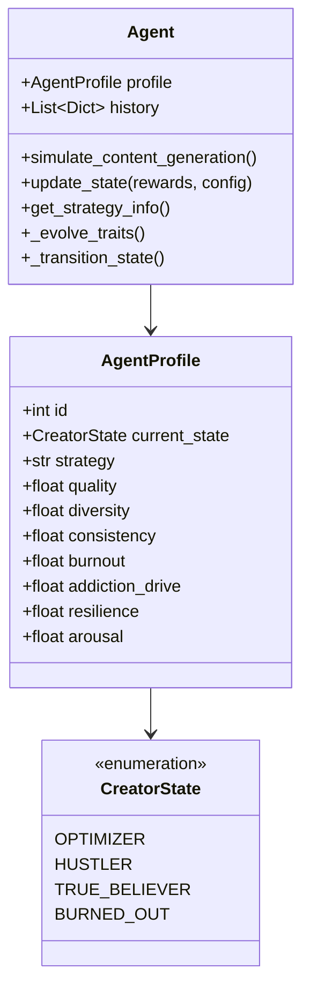
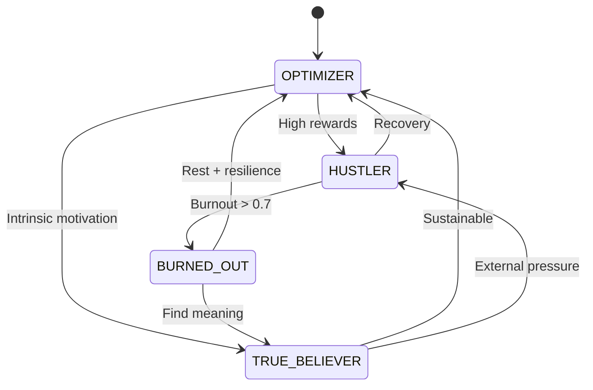

# Agent System

The agent system models individual content creators with realistic behaviors, psychological states, and economic outcomes.

## Agent Architecture



## Agent Profile

### Core Attributes

| Attribute | Range | Description |
|-----------|-------|-------------|
| `quality` | 0.0-1.0 | Content quality baseline |
| `diversity` | 0.0-1.0 | Topic/format variation |
| `consistency` | 0.0-1.0 | Posting regularity |
| `burnout` | 0.0-1.0 | Exhaustion level |
| `addiction_drive` | 0.0-1.0 | Compulsive behavior |
| `resilience` | 0.0-1.0 | Recovery ability |
| `arousal` | 0.0-1.0 | Platform engagement |

### Strategies

Agents select from 5 content strategies:

1. **Rapid Posting** - High volume, lower quality
2. **Strategic Pause** - Thoughtful, spaced content
3. **Consistent Quality** - Balanced approach
4. **Quality Over Quantity** - Premium content focus
5. **Volume Over Quality** - Maximum output

## State Machine

### States



### State Characteristics

#### OPTIMIZER
- **Balanced** - Sustainable content creation
- **Moderate burnout** - 0.3-0.5
- **Strategic** - Optimizes for long-term success
- **Transitions:** → HUSTLER (high rewards), → TRUE_BELIEVER (intrinsic)

#### HUSTLER
- **High output** - Maximizing short-term gains
- **Rising burnout** - 0.5-0.7
- **Reward-driven** - Chases metrics
- **Transitions:** → BURNED_OUT (exhaustion), → OPTIMIZER (recovery)

#### BURNED_OUT
- **Exhausted** - Low output, high stress
- **Critical burnout** - > 0.7
- **Recovery mode** - Needs rest
- **Transitions:** → OPTIMIZER (recovery), → TRUE_BELIEVER (meaning)

#### TRUE_BELIEVER
- **Intrinsically motivated** - Creates for passion
- **Low burnout** - < 0.3
- **Resilient** - Less affected by rewards
- **Transitions:** → OPTIMIZER (sustainable), → HUSTLER (pressure)

## Content Generation

### Formula

```python
posts_per_day = quality × (base_frequency + feedback_modifier) × 10.0
```

### Components

1. **Base Frequency** - Strategy-dependent baseline
2. **Feedback Modifier** - Reward-based adjustment
3. **Quality Multiplier** - Agent's quality trait
4. **Scaling Factor** - 10.0 for realistic volumes

### Strategy Frequencies

| Strategy | Base Frequency | Typical Output |
|----------|---------------|----------------|
| Rapid Posting | 0.8 | 6-8 posts/day |
| Strategic Pause | 0.3 | 2-4 posts/day |
| Consistent Quality | 0.5 | 4-6 posts/day |
| Quality Over Quantity | 0.4 | 3-5 posts/day |
| Volume Over Quality | 0.9 | 7-10 posts/day |

## Trait Evolution

### Burnout Accumulation

```python
if posts_generated > threshold:
    burnout += 0.05  # Accumulates with overwork
else:
    burnout -= 0.02  # Recovers with rest
```

### Addiction Dynamics

Driven by intermittent reinforcement:

```python
if reward_variance > threshold:
    addiction_drive += 0.03  # Unpredictable rewards
```

### Resilience Building

```python
if negative_reward and coping_successful:
    resilience += 0.01  # Grows through adversity
```

## History Tracking

Each tick, agents log:

```python
{
    "tick": 5,
    "state": "HUSTLER",
    "posts_generated": 7.5,
    "cpm_earnings": 375.00,
    "burnout": 0.65,
    "addiction_drive": 0.72,
    "resilience": 0.45,
    "quality": 0.80,
    "diversity": 0.60,
    "consistency": 0.75
}
```

## Example Usage

```python
# Create agent
profile = AgentProfile(id=1)
profile.strategy = "Quality Over Quantity"
agent = Agent(profile)

# Simulate content generation
posts = agent.simulate_content_generation()
print(f"Generated {posts:.1f} posts")

# Update with rewards
rewards = {
    "final_reward": 0.75,
    "cpm_earnings": 150.00
}
agent.update_state(rewards, policy_config)

# Check state
print(f"State: {agent.profile.current_state.name}")
print(f"Burnout: {agent.profile.burnout:.2f}")
```

## Future Extensions

### Hugging Face Integration

Stub methods for LLM-based content generation:

```python
# Build Markov chain from history
corpus = agent._build_markov_corpus()

# Generate content prompt
prompt = agent.generate_content_prompt_hf(
    temperature=0.7,
    max_tokens=100
)
```

See [Future Integrations](../development/future-integrations.md) for details.

## Related Documentation

- [State Machine Details](../research/state-machine.md)
- [Policy Engine](policy-engine.md)
- [Environment](environment.md)
