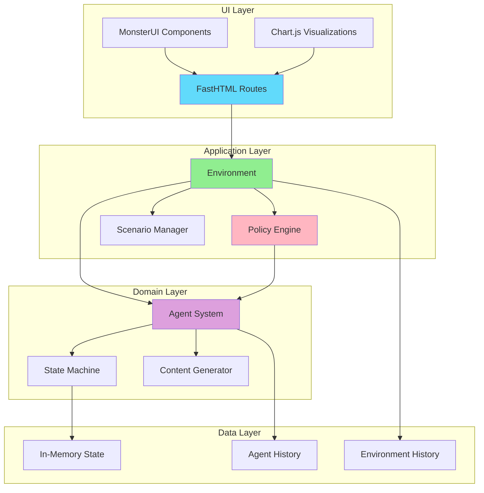
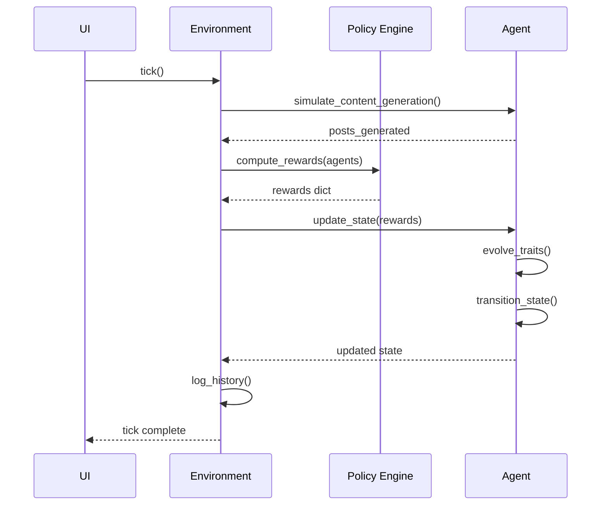
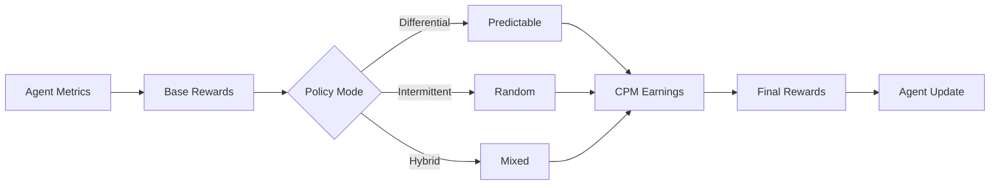

# Architecture Overview

The Platform Capitalism Simulation is built with a modular architecture that separates concerns between simulation logic, policy enforcement, and user interface.

## System Architecture



## Core Components

### 1. Environment (`simulation/environment.py`)

The central orchestrator that manages:

- **Agent lifecycle** - Creation, updates, state management
- **Tick execution** - Advances simulation by one time step
- **History tracking** - Stores metrics over time
- **Scenario management** - Loads and applies policy configurations

**Key Methods:**

```python
env = Environment(agents=agents)
env.tick()  # Advance one day
env.reset_full_state()  # Reset simulation
```

### 2. Policy Engine (`simulation/policy_engine/`)

Implements platform governance through:

- **Reward calculation** - Differential, intermittent, hybrid modes
- **CPM economics** - Earnings based on views and quality
- **Policy presets** - Exploitative, optimal, balanced, cooperative

**Configuration:**

```python
config = PolicyConfig(
    mode="differential",
    cpm_rate=10.0,
    avg_views_per_post=5000,
    quality_weight=0.3,
    burnout_penalty=0.4
)
```

### 3. Agent System (`simulation/agents/`)

Individual creator agents with:

- **Profile** - ID, strategy, quality, diversity, consistency
- **State machine** - OPTIMIZER, HUSTLER, BURNED_OUT, TRUE_BELIEVER
- **Content generation** - Dynamic post creation based on strategy
- **History tracking** - Posts, earnings, wellbeing metrics

**Agent Lifecycle:**

```python
agent = Agent(AgentProfile(id=1))
posts = agent.simulate_content_generation()
agent.update_state(rewards, policy_config)
```

### 4. UI Layer (`ui/`)

FastHTML-based interface with:

- **Dashboard** - Main simulation view
- **Governance Lab** - Policy configuration
- **Agent Cards** - Individual creator metrics
- **Decision Trees** - Transparency into agent decisions

## Data Flow

### Tick Execution Flow



### Reward Calculation Flow



## Technology Stack

### Backend

- **Python 3.11+** - Core language
- **FastHTML** - Web framework (Starlette-based)
- **MonsterUI** - UI components

### Frontend

- **HTMX** - Dynamic updates
- **Chart.js** - Visualizations
- **TailwindCSS** - Styling

### Deployment

- **Vercel** - Demo deployments
- **AWS Lightsail** - Research deployments
- **Docker** - Containerization
- **GitHub Actions** - CI/CD

## File Structure

```
platform-capitalism/
├── simulation/
│   ├── agents/           # Agent system
│   │   ├── agent.py      # Agent class
│   │   ├── profile.py    # Agent profile
│   │   └── state.py      # State machine
│   ├── policy_engine/    # Policy system
│   │   ├── core.py       # Reward calculation
│   │   └── config.py     # Policy configs
│   ├── scenarios/        # Scenario presets
│   └── environment.py    # Main orchestrator
├── ui/
│   ├── components/       # UI components
│   └── pages/           # Page routes
├── routes/              # API routes
├── tests/               # Test suite
└── deploy/              # Deployment configs
```

## Design Principles

### 1. Separation of Concerns

- **Simulation logic** independent of UI
- **Policy engine** decoupled from agents
- **State management** centralized in environment

### 2. Modularity

- **Pluggable policies** - Easy to add new governance models
- **Extensible agents** - Can add new traits/behaviors
- **Flexible UI** - Components can be reused

### 3. Transparency

- **Decision trees** - Show agent reasoning
- **Metrics tracking** - Full history available
- **Open source** - All code visible

### 4. Research-First

- **Empirically grounded** - Based on real research
- **Reproducible** - Deterministic when needed
- **Extensible** - Easy to add new experiments

## Performance Considerations

### In-Memory State

- **No database** - Fast, simple
- **State resets** - Clean slate each session
- **History limits** - Prevent memory bloat

### Optimization

- **Lazy evaluation** - Only compute when needed
- **Efficient updates** - Minimal re-renders
- **Caching** - Reuse computed values

## Next Steps

- [Agent System](agents.md) - Deep dive into agent architecture
- [Policy Engine](policy-engine.md) - Reward calculation details
- [Environment](environment.md) - Orchestration and state management
- [UI Components](ui.md) - Interface implementation
