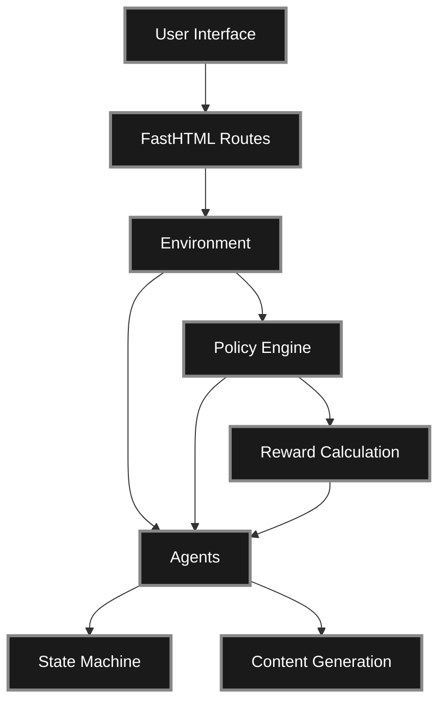

# Platform Capitalism Simulation

[](https://github.com/codeamt/platform-capitalism/actions/workflows/ci.yml)
[](https://www.python.org/downloads/)

> **A research-driven simulation exploring creator wellbeing under different platform governance models**

## Overview

This simulation environment models creator labor within platform economies using a state-machine framework where agents transition between four archetypal creative states—**Optimizer**, **Hustler**, **True Believer**, and **Burnout**—based on differential and intermittent reinforcement schedules.

## Key Features

- ✅ **CPM-based economics** ($2-$40 per 1,000 views)
- ✅ **Volume-based content generation** (3-10 posts/day)
- ✅ **Decision tree visualization** (agent decision-making transparency)
- ✅ **Multiple governance scenarios** (exploitative → cooperative)
- ✅ **Real-time metrics** (burnout, addiction, earnings, views)
- ✅ **State machine** (4 creator states with probabilistic transitions)
- ✅ **Reward systems** (differential, intermittent, hybrid)

## Quick Start

```bash
# Install dependencies
make install

# Run development server
make dev

# Run tests
make test
```

Open `http://localhost:5001` in your browser.

## Architecture Overview



## Research Foundation

Based on empirical research into creator economies, particularly:

**Primary Research:**

1. **Mears, A. (2025).** [*Learning to Like the Likes and the Hate: The Labor of Internet Fame in the New Attention Economy*](https://academic.oup.com/socpro/advance-article/doi/10.1093/socpro/spaf028/8165972). Social Problems.

2. **Mears, A. (2023).** [*Bringing Bourdieu to a Content Farm: Social Media Production Fields and the Cultural Economy of Attention*](https://journals.sagepub.com/doi/abs/10.1177/20563051231193027). Social Media + Society, 9(3).

**Key Insights:**

- **CPM-based monetization** ($2-$40 per 1,000 views)
- **Content farm economics** (median $5K-$30K/month per page)
- **Platform reinforcement strategies** (differential vs. intermittent)
- **Creator burnout and addiction patterns**
- **Capital conversion dynamics** (financial, status, cultural)

## Documentation Structure

### [Architecture](architecture/overview.md)
Deep dive into system components, data flow, and technical implementation.

### [Research](research/framework.md)
Theoretical framework, CPM economics, state machine, and capital conversion.

### [Development](development/getting-started.md)
Getting started, testing, deployment, and contributing guidelines.

### [API Reference](api/agents.md)
Detailed API documentation for agents, policy engine, and scenarios.

## Platform Governance Models

| Model | CPM | Reinforcement | Burnout | Earnings |
|-------|-----|---------------|---------|----------|
| **Exploitative** | $5 | Intermittent | High | Low |
| **Optimal** | $10 | Differential | Moderate | Fair |
| **Balanced** | $15 | Hybrid | Moderate | Good |
| **Cooperative** | $20 | Differential + UBI | Low | High |

## Contributing

We welcome contributions! See [Contributing Guide](development/contributing.md) for details.

## License

MIT License - see [LICENSE](https://github.com/codeamt/platform-capitalism/blob/main/LICENSE) for details.

## Acknowledgments

- Dr. Ashley Mears - University of Amsterdam (Primary Research)
- FastHTML framework
- MonsterUI component library
- Claude Sonnet 4.5 and Gemini 3 for Development Support 